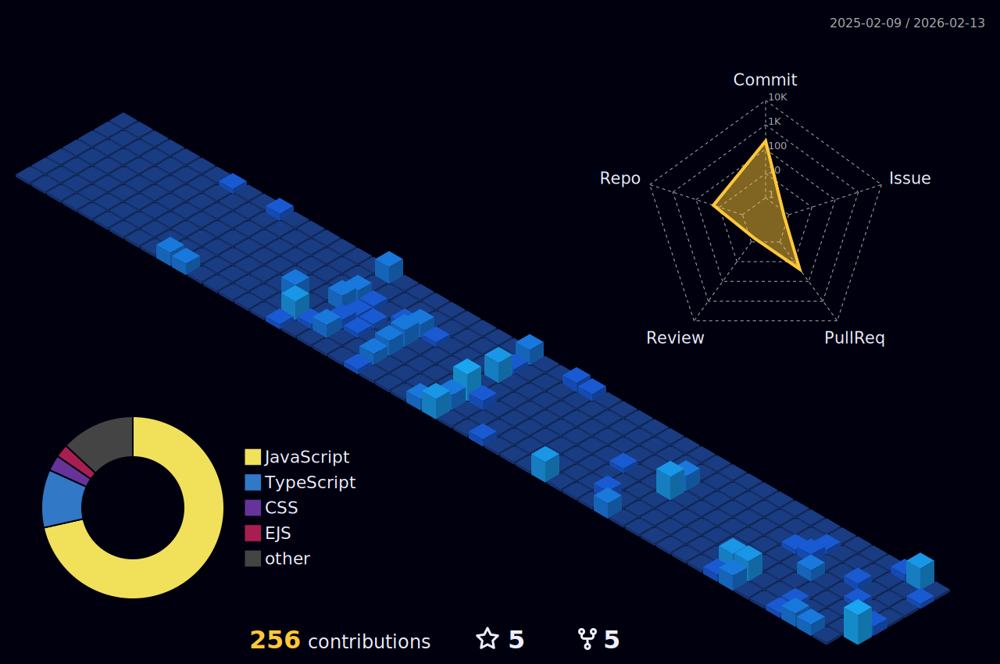

<h1 align="center">Hi, I'm Aditya</h1>
<h3 align="center">CSE @ NIT Jamshedpur | Full Stack Developer</h3>

  

 

- Building scalable, clean and performant web applications.  
- Focused on NEXT.js, MERN & modern UI/UX engineering.  
- Currently exploring DevOps, Three.js, Docker & AI/ML.  
- Reach me at **adityarajykme24@gmail.com**  

## Technologies I've worked with

  <!-- Languages -->
  

    
  

 
  <!-- Frontend -->
  

    
  

 
  <!-- Backend -->
  

    
  

 
  <!-- Databases -->
  

    
  

 
  <!-- DevOps & Cloud -->
  

    
  

 
  <!-- Tools -->
  

    
  

## My GitHub Stats

  
  <!--  -->

  

## Let's Connect!

🌐 Portfolio: https://yk-aditya.vercel.app  

<h3 align="center">Learn → Build → Scale → Repeat </h3>

